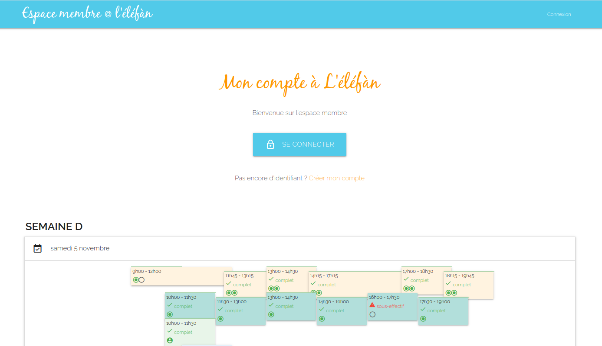
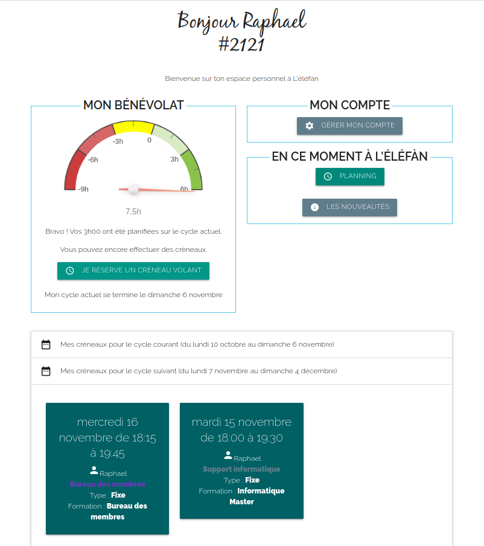
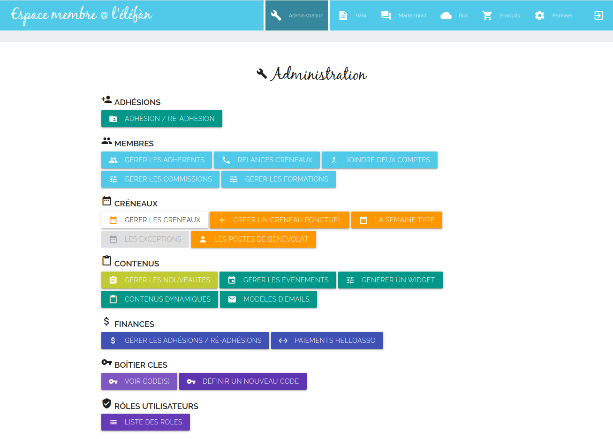

# Espace adhérent super marché coopératifs

Application symfony pour la gestion d'une épicerie ou d'un super marché coopératif.

Ce code est à l'initiative de [l'éléfan](https://lelefan.org/), projet grenoblois de super marché coopératif. 
Il est open source, sous licence GPLv3.

Cet outil est utilisé par plus d'une dizaine d'autres coopératives en France.

## Captures d'écran

_cliquez pour voir l'image en grand_

|Page d'accueil (anonyme)|Page d'accueil (membre)|Page d'administration|
|---|---|---|
||||

## Projet

* [Liste des Issues](https://github.com/elefan-grenoble/gestion-compte/issues) (n'hésitez pas à en créer une pour lancer la discussion !)
* [Board Kanban](https://github.com/elefan-grenoble/gestion-compte/projects/5)

## Installation

* [Guide d'installation](doc/install.md)
* [Guide de mise à jour](doc/maj.md)
* [Guide de mise en route](doc/start.md)

## Developpement

* Stack technique :
  * PHP 7.4
  * Symfony 3.4
  * jQuery 3.6
  * Materialize 1.2.1
  * MySQL/MariaDB

[Guide du développeur](doc/dev.md)

## Liste des fonctionnalités

Voir la documentation sur le [wiki](https://github.com/elefan-grenoble/gestion-compte/wiki)
